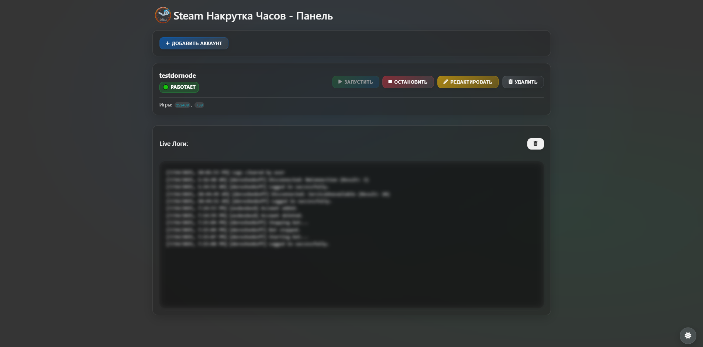

# Steam Hour Booster with Web Panel



Простой и удобный скрипт на Node.js для накрутки часов в Steam на нескольких аккаунтах с интуитивно понятной веб-панелью управления. Позволяет управлять аккаунтами, запускать и останавливать ботов, просматривать логи и настраивать игры прямо из браузера.

## Особенности

* **Поддержка нескольких аккаунтов:** Добавляйте, редактируйте и удаляйте учетные записи Steam через веб-интерфейс.
* **Веб-панель управления:** Управляйте всеми ботами из браузера (запуск, остановка).
* **Настраиваемые игры:** Указывайте список игр для каждого аккаунта, в которых нужно накручивать часы.
* **Автоматический вход и переподключение:** Боты пытаются автоматически переподключиться при разрыве соединения.
* **Поддержка Steam Guard:** Возможность ввода кодов Steam Guard (ручной ввод через веб-панель или автоматический при наличии `sharedSecret`).
* **Обработка сообщений:** Возможность получения, с(настраивается для каждого аккаунта).охранения и автоматического ответа на сообщения друзей 
* **Логирование:** Просмотр активности ботов и системных сообщений прямо в веб-панели.
* **Сохранение конфигурации:** Все настройки аккаунтов хранятся в файле `config/accounts.json`.

## Установка
Протестировано на Ubuntu 20.04.
Для запуска скрипта вам потребуется установленный Node.js и npm.

1.  **Обновите список пакетов и установите curl:**
    ```bash
    sudo apt update
    sudo apt install curl -y
    ```

2.  **Добавьте репозиторий NodeSource и установите Node.js (версия 22.x или выше):**
    ```bash
    curl -fsSL https://deb.nodesource.com/setup_22.x | sudo -E bash -
    sudo apt-get install -y nodejs
    ```

3.  **Клонируйте репозиторий (или скачайте файлы) и перейдите в папку проекта:**
    ```bash
    # Если используете Git:
    git clone https://github.com/Dornode/Steam-Hour-Booster.git
    cd Steam-Hour-Booster
    
    # Если скачали ZIP архив:
    # Распакуйте архив и перейдите в папку через терминал
    # cd /путь/к/вашей/папке
    ```

4.  **Установите зависимости проекта:**
    ```bash
    npm install
    ```

## Настройка

Основная настройка производится через веб-панель.

1.  **Запустите сервер:**
    Перейдите в корневую папку проекта в терминале и выполните:
    ```bash
    node web/server.js
    ```

2.  **Откройте веб-панель:**
    Откройте браузер и перейдите по адресу:
    ```
    http://localhost:3000
    ```
    (Если порт 3000 занят, проверьте вывод терминала при запуске сервера - он покажет используемый порт).

3.  **Добавление аккаунтов:**
    Нажмите кнопку "Добавить аккаунт" в веб-панели и заполните необходимые данные:
    * `Username` (Логин Steam)
    * `Password` (Пароль Steam)
    * `Shared Secret` (Опционально, для автоматического ввода Steam Guard. Можно получить с помощью инструментов типа Steam Desktop Authenticator)
    * `Enable Status` (Включить статус "В сети" при работе бота)
    * `Games and Status` (Список ID игр Steam, в которых нужно накручивать часы. ID игр можно найти, например, на [SteamDB](https://steamdb.info/))
    * `Reply Message` (Текст автоматического ответа на сообщения друзей)
    * `Receive Messages` (Получать ли сообщения друзей)
    * `Save Messages` (Сохранять ли сообщения друзей в файлы)

4.  **Файл `config/accounts.json`:**
    Все добавленные и отредактированные аккаунты автоматически сохраняются в файле `config/accounts.json` в корневой директории проекта. Вы можете редактировать этот файл вручную, но рекомендуется делать это через веб-панель, чтобы избежать ошибок форматирования JSON.

## Использование

После добавления аккаунтов через веб-панель:

1.  **Запуск ботов:** Нажмите кнопку "Старт" напротив нужного аккаунта в списке на веб-панели.
2.  **Остановка ботов:** Нажмите кнопку "Стоп" напротив работающего аккаунта.
3.  **Просмотр логов:** В нижней части веб-панели отображаются логи активности ботов и системные сообщения.
4.  **Ввод Steam Guard:** Если для аккаунта требуется ввод Steam Guard и вы не указали `sharedSecret`, веб-панель запросит код, который вы должны ввести.
